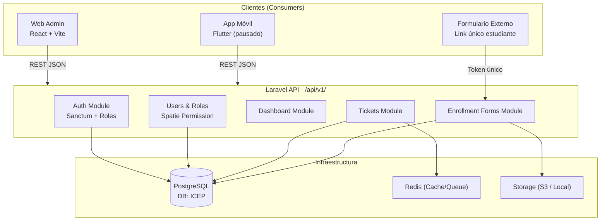

# CRM ICEP — Plan de Desarrollo en Sprints

**Proyecto:** CRM Académico Modular — ICEP  
**Stack:** Laravel 11+ (API-first) · Vite + React (Web Admin) · Flutter (pausado, arquitectura lista)  
**Paradigma:** Desacoplado, API REST versionada, lógica de negocio en backend  

---

## Arquitectura General del Sistema



### Principios de Diseño

| Principio | Decisión |
|---|---|
| **API-first** | Toda funcionalidad expuesta vía `/api/v1/`, sin Blade en el CRM |
| **Versionado** | Prefijo `/api/v1/` desde el inicio para facilitar migraciones futuras |
| **Auth** | Laravel Sanctum con tokens de sesión (compatible web y móvil) |
| **Permisos** | Spatie Laravel Permission — roles combinables por usuario |
| **Respuestas** | JSON uniforme: `{ data, message, meta, errors }` en todos los endpoints |
| **Frontend** | React + Vite SPA · Inertia.js opcional solo si se decide SSR; por defecto: API REST pura |
| **Separación** | Lógica de negocio en Services/Actions de Laravel. Frontend solo consume y renderiza |
| **Modularidad** | Dominios separados en Laravel (Auth, Users, Roles, Dashboard, Tickets, Enrollments) |

---

## Estructura de Directorios

### Backend — Laravel

```
app/
├── Modules/
│   ├── Auth/
│   │   ├── Controllers/AuthController.php
│   │   └── Requests/LoginRequest.php
│   ├── Users/
│   │   ├── Controllers/UserController.php
│   │   ├── Models/User.php
│   │   └── Services/UserService.php
│   ├── Roles/
│   │   ├── Controllers/RoleController.php
│   │   └── Services/RoleService.php
│   ├── Dashboard/
│   │   └── Controllers/DashboardController.php
│   ├── Tickets/
│   │   ├── Controllers/TicketController.php
│   │   ├── Models/Ticket.php
│   │   ├── Models/TicketHistory.php
│   │   └── Services/TicketService.php
│   └── Enrollments/
│       ├── Controllers/EnrollmentFormController.php
│       ├── Models/EnrollmentForm.php
│       └── Services/EnrollmentFormService.php
routes/
└── api.php  (versionado: /api/v1/)
```

### Frontend — React + Vite

```
src/
├── modules/
│   ├── auth/
│   │   ├── pages/LoginPage.tsx
│   │   └── hooks/useAuth.ts
│   ├── dashboard/
│   │   └── pages/DashboardPage.tsx
│   ├── tickets/
│   │   ├── pages/TicketListPage.tsx
│   │   ├── pages/TicketDetailPage.tsx
│   │   └── components/TicketCard.tsx
│   └── enrollments/
│       ├── pages/EnrollmentListPage.tsx
│       └── pages/PublicEnrollmentForm.tsx
├── shared/
│   ├── components/  (Button, Modal, Table, Badge…)
│   ├── hooks/       (useApi, usePermissions, useToast…)
│   ├── layouts/     (AppLayout, AuthLayout)
│   └── services/    (api.ts con Axios interceptors)
└── App.tsx
```

---

## Modelo de Roles y Permisos

> [!IMPORTANT]
> Los roles son **combinables**. Un usuario puede tener múltiples roles simultáneos. Los permisos se heredan de la unión de todos sus roles asignados. La lógica de autorización vive **exclusivamente en el backend**.

### Roles Iniciales

| Rol | Descripción |
|---|---|
| `admin` | Control total: usuarios, configuración, permisos, visualización global |
| `jefe` | Visualización global de operaciones, sin cambios en configuración crítica |
| `jefe_departamento` | Administra procesos y tickets de su propia área |
| `jefe_asesores` | Supervisa asesores, formularios de matrícula y seguimiento postventa |
| `asesor_academico` | Registra ventas, genera formularios y hace seguimiento al registro del estudiante |
| `estudiante` | **Pausado** — no tiene acceso autenticado en esta fase |

### Permisos Granulares (ejemplos)

```
tickets.create · tickets.view · tickets.edit · tickets.close · tickets.reprioritize
users.create · users.edit · users.view_all
enrollments.create · enrollments.view · enrollments.approve · enrollments.void
dashboard.view_global · dashboard.view_own_department
roles.assign · settings.manage
```

---

## Sprint 0 — Setup, Arquitectura Base y Estándares (1 semana)

**Objetivo:** Proyecto creado, configurado y con arquitectura definida. Cero funcionalidad de negocio, máxima solidez técnica.

### Backend (Laravel)

- [ ] Crear proyecto Laravel 11 con PHP 8.3
- [ ] Configurar `.env` para desarrollo local:
  ```env
  DB_CONNECTION=pgsql
  DB_HOST=127.0.0.1
  DB_PORT=5432
  DB_DATABASE=ICEP
  DB_USERNAME=postgres
  DB_PASSWORD=1995
  ```
- [ ] Instalar dependencias clave:
  - `laravel/sanctum` — autenticación API
  - `spatie/laravel-permission` — roles y permisos granulares
  - `spatie/laravel-query-builder` — filtros y paginación en API
  - `laravellegends/laravel-data` o DTO pattern manual
  - `pestphp/pest` — testing
- [ ] Configurar estructura de módulos en `app/Modules/`
- [ ] Crear `ApiResponse` helper para respuestas JSON uniformes
- [ ] Configurar versionado de API en `routes/api.php` bajo `/api/v1/`
- [ ] Configurar CORS para el frontend en desarrollo
- [ ] Configurar autenticación Sanctum con guards de API
- [ ] Seeders base: roles, permisos y usuario administrador inicial
- [ ] README con instrucciones de setup para el equipo

### Frontend (React + Vite)

- [ ] Crear proyecto con `npm create vite@latest -- --template react-ts`
- [ ] Instalar dependencias:
  - `axios` — cliente HTTP con interceptors
  - `react-router-dom` — routing SPA
  - `zustand` — gestión de estado global liviana
  - `react-hook-form` + `zod` — formularios con validación
  - `@tanstack/react-query` — cache de datos y sincronización con API
  - `lucide-react` — iconos
  - `clsx` + `tailwindcss` — estilos (o CSS Modules según preferencia)
- [ ] Configurar Axios con interceptor de token Bearer y refresh token handler
- [ ] Crear `AuthContext` y sistema de rutas protegidas por permisos
- [ ] Definir design tokens (colores, tipografía, espaciado) en CSS variables
- [ ] Crear layout base: `AppLayout` (sidebar + topbar) y `AuthLayout`
- [ ] Configurar aliases de paths en `vite.config.ts` (`@/modules`, `@/shared`)

**Entregables:** Proyecto funcionando localmente, API responde `200 OK` en `/api/v1/health`, login placeholder funcional.

---

## Sprint 1 — Autenticación, Usuarios, Roles y Permisos (1.5 semanas)

**Objetivo:** Login seguro basado en roles. CRUD completo de usuarios y gestión de roles/permisos.

### Backend

- [ ] **Auth Module:**
  - `POST /api/v1/auth/login` — login con email/password, devuelve token Sanctum
  - `POST /api/v1/auth/logout` — revoca el token activo
  - `GET /api/v1/auth/me` — devuelve usuario autenticado con roles y permisos
  - Rate limiting en login (5 intentos/min) con `ThrottleRequests`
  - Validación estricta con `FormRequest`

- [ ] **Users Module:**
  - `GET /api/v1/users` — lista paginada (filtros: rol, estado, búsqueda)
  - `POST /api/v1/users` — crear usuario con rol(es) asignado(s)
  - `GET /api/v1/users/{id}` — detalle de usuario
  - `PUT /api/v1/users/{id}` — editar usuario (nombre, email, estado)
  - `POST /api/v1/users/{id}/roles` — asignar/revocar roles a usuario
  - `DELETE /api/v1/users/{id}` — soft-delete

- [ ] **Roles Module:**
  - `GET /api/v1/roles` — listado de roles con sus permisos
  - `GET /api/v1/permissions` — listado de todos los permisos disponibles

- [ ] Middleware `CheckPermission` para proteger rutas por permiso granular
- [ ] Política: `UserPolicy` para autorización en controllers

### Frontend

- [ ] Página de Login con validación y manejo de errores
- [ ] Almacenamiento seguro del token (HttpOnly cookie o localStorage con refresh)
- [ ] Guard de rutas: redirige no autenticados y no autorizados
- [ ] Módulo de Usuarios: tabla, modal de creación/edición, asignación de roles
- [ ] Módulo de Roles: vista de roles y permisos asignados (solo admin)
- [ ] `usePermissions` hook para ocultar/mostrar UI según permisos del usuario

**Entregables:** Login funcional, usuarios creados con múltiples roles, rutas protegidas.

---

## Sprint 2 — Dashboard por Rol (1 semana)

**Objetivo:** Dashboard adaptativo que presente información relevante según el perfil del usuario autenticado.

### Backend

- [ ] `GET /api/v1/dashboard` — endpoint que detecta el rol del usuario y devuelve el payload correspondiente:
  - **Admin / Jefe:** métricas globales (tickets abiertos, formularios pendientes, usuarios activos)
  - **Jefe de departamento:** tickets de su área (abiertos, en progreso, cerrados)
  - **Jefe de asesores:** formularios generados por sus asesores (estados, pendientes de revisión)
  - **Asesor académico:** formularios propios (enviados, completados, pendientes)

### Frontend

- [ ] Componentes de widgets reutilizables: `StatCard`, `ProgressBar`, `ActivityFeed`
- [ ] Dashboard renderiza condicionalmente según permisos retornados por la API
- [ ] Mini-lista de tickets recientes y formularios recientes en el dashboard
- [ ] Navegación lateral (sidebar) condicionada por permisos del usuario

**Entregables:** Dashboard diferenciado por rol, datos reales desde la API.

---

## Sprint 3 — Módulo de Tickets Internos (2 semanas)

**Objetivo:** Sistema de gestión de tickets entre áreas con cola de prioridad, trazabilidad completa y auditoría de cambios.

### Modelo de Datos

```
tickets
  id, title, description, area_id (destino), 
  requester_id, assignee_id, priority (normal|urgent|priority),
  status (open|in_progress|paused|closed|cancelled),
  due_date, position (orden en cola), created_at, updated_at, deleted_at

ticket_histories
  id, ticket_id, user_id, action, 
  old_value, new_value, reason, created_at

areas
  id, name, description, created_at

comments
  id, ticket_id, user_id, body, created_at
```

### Backend

- [ ] `GET /api/v1/tickets` — lista con filtros (área, estado, prioridad, asignado)
- [ ] `POST /api/v1/tickets` — crear ticket; asigna posición en cola automáticamente
- [ ] `GET /api/v1/tickets/{id}` — detalle con historial y comentarios
- [ ] `PUT /api/v1/tickets/{id}` — editar ticket (título, descripción, asignado, fecha)
- [ ] `PATCH /api/v1/tickets/{id}/status` — cambiar estado + registra en `ticket_histories`
- [ ] `PATCH /api/v1/tickets/{id}/priority` — cambiar prioridad urgente: mueve al frente de la cola, pausa el ticket actual y registra en `ticket_histories` (quién, cuándo, por qué, qué ticket fue desplazado)
- [ ] `POST /api/v1/tickets/{id}/comments` — agregar comentario
- [ ] `GET /api/v1/areas` — listado de áreas del sistema
- [ ] `TicketService` con toda la lógica de negocio: ordenamiento de cola, cambios de prioridad, auditoría automática
- [ ] Política `TicketPolicy`: validaciones de qué roles pueden crear, editar, reprioritizar o cerrar

### Frontend

- [ ] Vista de cola de tickets (Kanban o lista ordenada por posición)
- [ ] Formulario de creación de ticket (área destino, prioridad, asignado, descripción)
- [ ] Vista detalle: historial de cambios, comentarios, cambio de estado
- [ ] Indicador visual claro de tickets urgentes/prioritarios en la cola
- [ ] Modal de cambio de prioridad con campo obligatorio de "motivo"
- [ ] Filtros por área, estado, prioridad y asignado

**Entregables:** Sistema de tickets completamente funcional con historial de auditoría.

---

## Sprint 4 — Módulo de Formularios de Matrícula Postventa (2 semanas)

**Objetivo:** Permitir al asesor generar un enlace único para que el estudiante complete su información de matrícula, con trazabilidad del proceso.

### Modelo de Datos

```
enrollment_forms
  id, uuid (token público único), advisor_id, course_id,
  student_name, student_email, student_phone, 
  student_id_number, student_city,
  extra_data (JSON — campos adicionales futuros),
  status (pending_send|sent|completed|in_review|approved|incomplete|void),
  sent_at, completed_at, reviewed_at, created_at, updated_at

enrollment_form_histories
  id, enrollment_form_id, user_id, action, old_status, new_status, 
  notes, created_at

courses (catálogo básico)
  id, name, area_id, created_at
```

### Backend

- [ ] `GET /api/v1/enrollments` — lista de formularios del asesor (o todos para supervisores)
- [ ] `POST /api/v1/enrollments` — crear formulario + genera UUID público único
- [ ] `GET /api/v1/enrollments/{id}` — detalle con historial
- [ ] `PATCH /api/v1/enrollments/{id}/status` — cambiar estado + registra historial
- [ ] `DELETE /api/v1/enrollments/{id}` — anular formulario (soft-delete)
- [ ] **Endpoint público (sin auth):**
  - `GET /api/v1/public/enrollment/{uuid}` — retorna campos del formulario para el estudiante
  - `POST /api/v1/public/enrollment/{uuid}/submit` — estudiante envía sus datos; valida token no expirado y no completado
- [ ] Rate limiting en endpoint público para prevenir abuso
- [ ] `EnrollmentFormService` con gestión de estados, generación de UUID y validaciones

### Frontend (Admin)

- [ ] Lista de formularios con estado visual (badges de colores)
- [ ] Formulario de creación: selección de asesor, curso, datos iniciales del estudiante
- [ ] Botón "Copiar enlace" para enviar al estudiante
- [ ] Vista de detalle con historial de estados y datos completados
- [ ] Filtros por asesor, estado, curso y rango de fechas

### Frontend (Estudiante — Público)

- [ ] Página pública `/enrollment/:uuid` accesible sin login
- [ ] Formulario limpio, responsive, con validación del lado cliente
- [ ] Mensaje de "formulario ya completado" si el UUID ya fue usado
- [ ] Mensaje de "enlace no válido" si el UUID no existe o está anulado
- [ ] Confirmación visual al enviar correctamente

**Entregables:** Flujo completo de matrícula postventa: creación → enlace → llenado → revisión → aprobación.

---

## Sprint 5 — Integración, QA y Preparación para Producción (1 semana)

**Objetivo:** Sistema estable, testeado, documentado y listo para un despliegue inicial.

### QA y Testing

- [ ] Tests unitarios con Pest: `UserService`, `TicketService`, `EnrollmentFormService`
- [ ] Tests de feature para endpoints principales (autenticación, tickets, formularios)
- [ ] Test de roles y permisos: verificar que cada rol solo puede hacer lo que debe
- [ ] Pruebas del formulario público con UUID válido, expirado y ya usado
- [ ] Revisión de seguridad: CORS, rate limiting, sanitización de inputs, SQL injection

### Calidad de Código

- [ ] Revisión de todos los `FormRequest` y validadores
- [ ] Verificar respuestas uniformes en todos los endpoints
- [ ] Configurar `Laravel Pint` para formato de código

### Documentación

- [ ] Documentar todos los endpoints en Postman Collection o Bruno
- [ ] README actualizado con instrucciones de instalación, migraciones y seeders
- [ ] Documentar convenciones de permisos y nomenclatura

### Preparación Flutter (Futura Integración)

- [ ] Verificar que todos los endpoints devuelvan respuestas limpias en formato estándar
- [ ] Documentar estructura de respuesta de `GET /api/v1/auth/me` (incluye roles y permisos)
- [ ] Asegurar que la autenticación funcione con Bearer Token (compatible con Flutter)

**Entregables:** Sistema listo para producción, collection de API exportada, tests activos.

---

## Resumen Visual de Sprints

| Sprint | Duración | Foco Principal | Entregable Clave |
|---|---|---|---|
| **Sprint 0** | 1 semana | Setup + Arquitectura base | Proyecto corriendo, estructura definida |
| **Sprint 1** | 1.5 semanas | Auth · Usuarios · Roles · Permisos | Login funcional + CRUD usuarios |
| **Sprint 2** | 1 semana | Dashboard por rol | Dashboard adaptativo por perfil |
| **Sprint 3** | 2 semanas | Módulo Tickets Internos | Cola priorizada + auditoría completa |
| **Sprint 4** | 2 semanas | Módulo Matrícula Postventa | Formulario público con UUID + flujo de estados |
| **Sprint 5** | 1 semana | QA · Testing · Documentación | Sistema estable listo para producción |
| **TOTAL** | **~8.5 semanas** | | CRM académico operativo Fase 1 |

---

## Convenciones de API

```
# Respuesta exitosa estándar
{
  "data": { ... },
  "message": "OK",
  "meta": { "total": 50, "page": 1, "per_page": 15 }
}

# Respuesta de error estándar  
{
  "data": null,
  "message": "No tienes permiso para realizar esta acción",
  "errors": { "field": ["El campo es requerido"] }
}
```

### Códigos HTTP usados

| Código | Uso |
|---|---|
| `200` | GET, PUT, PATCH exitosos |
| `201` | POST creación exitosa |
| `204` | DELETE exitoso |
| `400` | Error de validación |
| `401` | No autenticado |
| `403` | No autorizado (sin permiso) |
| `404` | Recurso no encontrado |
| `429` | Rate limit excedido |
| `500` | Error interno del servidor |

---

## Módulos Futuros (Post Fase 1)

- 📊 **Reportes y Analytics** — métricas de ventas, conversión, rendimiento por asesor
- 📱 **App Móvil Flutter** — consume la misma API ya preparada
- 📄 **Gestión Documental** — adjuntos para matrículas y tickets
- 🔔 **Notificaciones** — email y push notification por eventos del sistema
- 💼 **Seguimiento Comercial** — pipeline de ventas y prospección
- 🎓 **Procesos Académicos** — módulo de cursos, horarios y docentes
